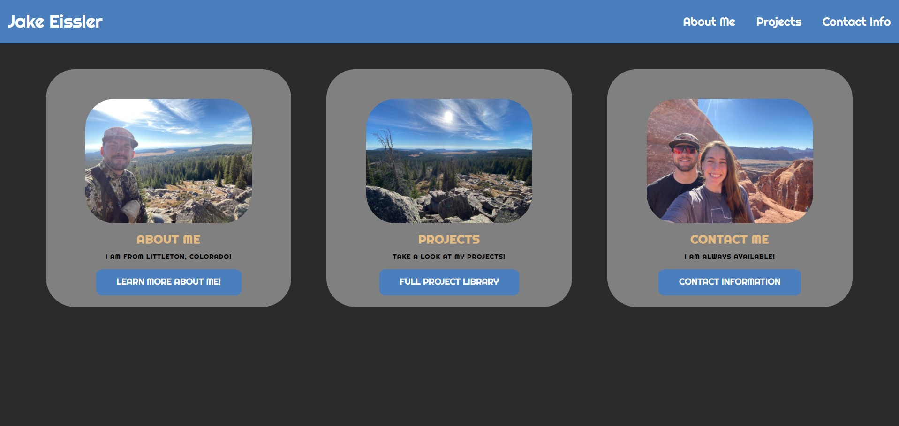

# Eissler-Portfolio

In this repository you will find the beginning code base for my professional portfolio. I am very excited about it as I know it will only get better with time! My portfolio is in the very early stages of development because I do not have any projects to add to it yet.

The links in the nav bar will navigate the user to the respective cards on the page. Each card has been set up to direct the user to other pages (info about me, my projects, contact info) but the links currently go to other sites because we have not created any other pages yet.

I decided to structure the page in a card style because I thought it looked very professional for a portfolio-style page. The cards also worked very well in terms of responsiveness with CSS flex-boxes, which are implemented in the page. Along with the flex-box properties, the cards responded well to different user interfaces through the use of media queries. The hover pseudoclass is applied to all of the links in the page giving the user more interactiveness on the page.

This initial portfolio building project has taught me that the possibilities are truly endless with just a little bit of knowledge of HTML and CSS. I am very excited to be able to make this page even more responsive and user friendly as my knowledge-base grows throughout the bootcamp! I cannot wait to be able to tell a potential employer down the road that I began this project after only one week of coding!

Link to deployed application: https://jakeeis24.github.io/Eissler-Portfolio/

